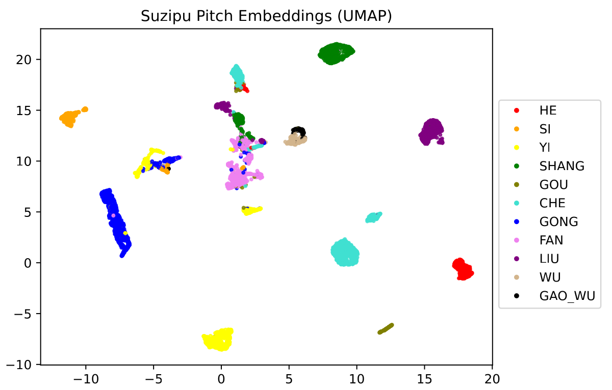
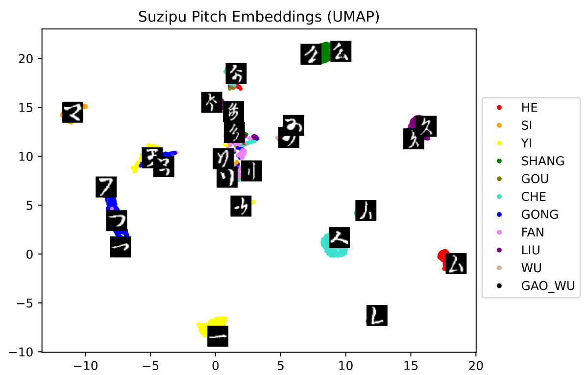

# SuziOMR
The development of deep learning algorithms for optical music recognition (OMR) of *suzipu* and *lülüpu* musical notations.




## How to Cite

The current baseline of the *suzipu* and *lülüpu* OMR algorithms is contained in the publication:

[KuiSCIMA v2.0: Improved Baselines, Calibration, and Cross-Notation Generalization for Historical Chinese Music Notations in Jiang Kui's Baishidaoren Gequ](https://doi.org/10.48550/arXiv.2507.18741) (currently only available as preprint)

```
@misc{RepoluskIcdar2025,
  author       = {Repolusk, Tristan and Veas, Eduardo},
  title        = {KuiSCIMA v2.0: Improved Baselines, Calibration, and Cross-Notation Generalization for Historical Chinese Music Notations in Jiang Kui's Baishidaoren Gequ},
  note         = {Accepted for publication at ICDAR 2025 (in press)},
  year         = {2025},
  eprint       = {arXiv:2507.18741},
  archivePrefix= {arXiv},
  primaryClass = {cs.CV},           
  url          = {https://arxiv.org/abs/2507.18741}
}
```

[comment]: <> ( ``` )
[comment]: <> ( @InProceedings{RepoluskIcdar2025, )
[comment]: <> (   author={Repolusk, Tristan and Veas, Eduardo}, )
[comment]: <> (   editor={Yin, Xu-Cheng and Karatzas, Dimosthenis and Lopresti, Daniel}, )
[comment]: <> (   title={KuiSCIMA v2.0: Improved Baselines, Calibration, and Cross-Notation Generalization for Historical Chinese Music Notations in Jiang Kui's Baishidaoren Gequ}, )
[comment]: <> (   booktitle={Document Analysis and Recognition - ICDAR 2024}, )
[comment]: <> (   year={2025}, )
[comment]: <> (   publisher={Springer Nature Switzerland}, )
[comment]: <> (   address={Cham}, )
[comment]: <> (   pages={xx--yy}, )
[comment]: <> (   doi={TODO} )
[comment]: <> ( } )
[comment]: <> ( ``` )

## Documentation

In the folder `baseline`, the individual scripts and source files are contained:

**Scripts:**
* `00_notation_clustering.ipynb`: Contains the algorithms for the creation of the *Notation Clustering* display. See Chapter 6.1 in my dissertation.

*Suzipu*:
* `01_suzipu_models.ipynb`: The OMR models, training, and analysis for *suzipu* notation.
* `02_suzipu_temperature_scaling.ipynb`: Temperature scaling for *suzipu* models.
* `03_suzipu_clustering_and_similarity`: UMAP clustering of *suzipu* instances according to model features. 
* `05_suzipu_metrics.ipynb`: Comparison of OMR with human baseline from the user study.

*Lülüpu*:
* `01_lvlvpu_models.ipynb`: The OMR models, training, and analysis for *lülüpu* notation.
* `02_lvlvpu_temperature_scaling.ipynb`: Temperature scaling for *lülüpu* models.
* `03_lvlvpu_clustering_and_similarity.ipynb`: UMAP clustering of *lülüpu* instances according to model features.
* `04_lvlvpu_tesseract`: Comparison of the *lülüpu* algorithms with a Tesseract OCR baseline.

**Source files:**
* `data_extraction.py`: Function for extracting the individual annotated notation images from the KuiSCIMA corpus.
* `image_manipulation.py`: Contains image preprocessing steps, data augmentations, and the PyTorch DataLoaders with visualization functions.
* `lvlvpu.py`: Defines the Python digital representation of *lülüpu* notation.
* `model.py`: Defines the CNN architecture, the temperature scaling, and the loss function (focal loss).
* `stats.py`: Function for returning confidence intervals.
* `suzipu.py`: Defines the Python digital representation of *suzipu* notation.

**Statistics files:**
* `study_statistics.json`: Contains the accumulated results of the user study

For the technical documentation of the individual parts in the source code, please refer to the [chapter in my dissertation](suziomr_documentation.pdf).